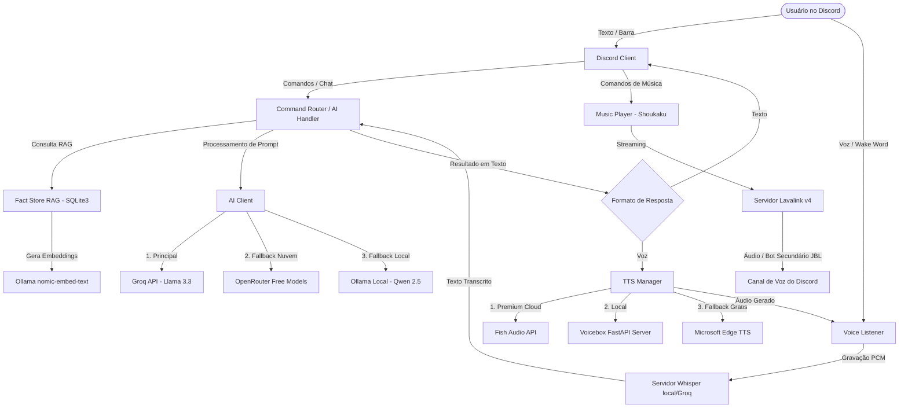
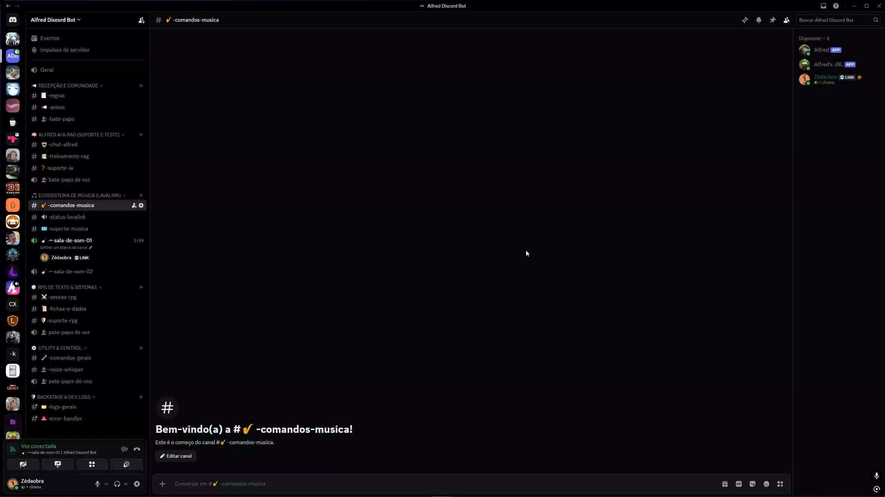
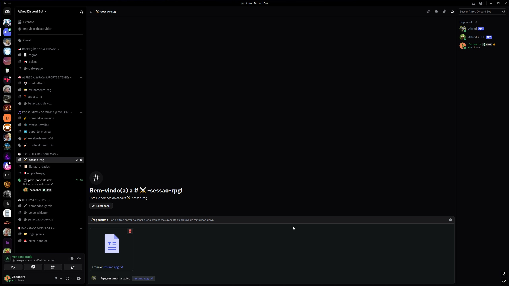

# 🤖 Alfred — Assistente Inteligente com IA, Música por Voz & Painel Web

[](https://opensource.org/licenses/MIT)
[](https://nodejs.org)
[](https://discord.js.org)

O **Alfred** é um bot modular e avançado de Discord que combina inteligência artificial conversacional (via Groq/Llama), memória persistente de longo prazo (RAG via SQLite3 e embeddings locais com Ollama), análise de imagens/documentos, escuta ativa por voz e um robusto sistema de música premium baseado em Lavalink v4 com arquitetura dual-bot.

Além de interagir via texto e voz, ele possui um **Painel Web Administrativo** completo para gerenciar whitelist de servidores, visualizar logs em tempo real, gerenciar as memórias aprendidas pelo bot e controlar permissões de usuário.

---

## 📐 Arquitetura do Sistema

O diagrama abaixo ilustra como os diferentes módulos do Alfred se comunicam:



---

## ✨ Principais Funcionalidades

### 1. 🧠 IA Conversacional Avançada & Memória (RAG)
- **Cadeia de Fallbacks Dinâmica:** O bot tenta primeiro utilizar a API do **Groq** (alta velocidade). Caso atinja o rate limit (erro 429), ele muda temporariamente para o **OpenRouter** (grátis) pelo tempo sugerido pelo cabeçalho da API. Se ambos falharem ou estiverem offline, ele roteia automaticamente para o **Ollama** rodando localmente (`qwen2.5:14b`).
- **Memória de Longo Prazo:** O Alfred extrai fatos das conversas em segundo plano e os armazena no SQLite (`memory.db`). Quando você faz uma pergunta, ele pesquisa as memórias usando embeddings vetoriais locais (`nomic-embed-text` no Ollama) para contextualizar a resposta.

### 2. 🎵 Música Premium Dual-Bot (Alfred + JBL)
- **Coexistência de Voz e Música:** O bot principal (**Alfred**) escuta e responde comandos de voz no mesmo canal em que o bot secundário (**JBL**) reproduz música, evitando conflitos de áudio no Discord.
- **Autoplay Inteligente (Modo DJ):** Baseado na lista de reprodução, o Alfred enfileira faixas parecidas automaticamente. Ele possui filtros para limpar títulos redundantes (covers, versões ao vivo, acústicos) e evitar loops de faixas parecidas.
- **Fila e Transição Fluida:** Utiliza o avançado driver Shoukaku/Lavalink-client com suporte a avanço automático de faixas (AutoSkip) nativo e reconexão automática resiliente.

### 3. 🎤 Comandos de Voz Dinâmicos & TTS
- **Detecção de Wake Word:** Monitora a chamada de voz em tempo real e identifica a palavra de ativação *"Alfred"* em qualquer parte da frase (ex: *"Toca um rock legal, Alfred"* ou *"Alfred, pode pausar"*).
- **Audio Ducking:** Diminui o volume do reprodutor de música em 80% temporariamente quando o usuário começa a falar ou quando o bot está gerando resposta de voz.
- **Síntese de Voz (TTS) com 3 Camadas:**
  1. **Fish Audio Cloud API:** Geração de voz premium e realista com clonagem de vozes.
  2. **Voicebox Local Server:** Geração via API local rodando em Python com modelos locais (Qwen/Kokoro/Chatterbox).
  3. **Edge TTS:** Fallback gratuito baseado na API de síntese do Microsoft Edge.

### 4. 🤫 Modo RPG (Imersivo)
- O bot silencia embeds decorativos e logs de texto chatos durante sessões de jogo.
- **Música de Ambiente Baseada em Humor:** Altera a playlist de background de acordo com o humor do jogo (ex: combate, exploração, taverna) definido pelo comando `/rpg humor [tipo]`.
- **Crônica e Narrador:** Grava os eventos do RPG e gera um resumo narrado por voz ao final da sessão usando uma voz de narrador configurável (`FISH_RPG_NARRATOR_VOICE_ID`).

### 5. 🖥️ Painel Web Administrativo
- **Dashboard em Express:** Interface web moderna para gerenciar o bot.
- **Controles:**
  - Whitelist de servidores (bloquear/permitir uso em guildas).
  - Gerenciador de fatos e memórias (ver e apagar fatos aprendidos pelo RAG).
  - Logs detalhados em tempo real diretamente na tela.
  - Painel de controle de permissões por nível de usuário.

---

## 🎥 Demonstração de Funcionamento

Abaixo você pode conferir exemplos práticos do Alfred em ação. Clique nas imagens para assistir aos vídeos:

### ⚙️ Chamadas de Funções Inteligentes (Tool Use)
O Alfred decide autonomamente quando utilizar ferramentas locais e externas para enriquecer a conversa (pesquisar na web, checar previsão do tempo, buscar informações de filmes ou gerenciar as fichas de RPG):

[](https://github.com/Zeraora-ph/alfred-discord-bot/blob/main/docs/media/alfred_functions.mp4?raw=true)

### 🎭 Comandos por Voz & Narração Dramática de RPG
Demonstração do Alfred operando por voz no canal do Discord, interpretando comandos com wake word, aplicando atenuação dinâmica de áudio (Audio Ducking) e gerando uma narração imersiva no modo RPG com efeitos vocais customizados:

[](https://github.com/Zeraora-ph/alfred-discord-bot/blob/main/docs/media/demonstracao_rpg.mp4?raw=true)

---

## 🛠️ Requisitos de Sistema

- **Node.js:** Versão `>= 18.0.0`
- **Redis:** Para gerenciamento de sessões do painel e caching
- **Java JRE 17+:** Necessário para rodar o **Lavalink.jar**
- **Ollama:** Para embeddings locais e fallback de LLM
- **Python 3.10+:** Se desejar rodar o Whisper local ou o servidor Voicebox local

---

## 🚀 Instalação e Configuração

### 1. Instalar Dependências
```bash
git clone https://github.com/Zeraora-ph/alfred-discord-bot.git
cd alfred-discord-bot
npm install
```

### 2. Configurar Variáveis de Ambiente
Copie o arquivo de exemplo e preencha as variáveis necessárias no `.env`:
```bash
cp .env.example .env
```

### 3. Configurar os Embeddings do Ollama
Certifique-se de que o Ollama está rodando e instale o modelo de embeddings:
```bash
ollama pull nomic-embed-text
# Opcional (se usar LLM local):
ollama pull qwen2.5:14b
```

### 4. Lavalink Server
Baixe a versão mais recente do [Lavalink v4](https://github.com/lavalink-devs/Lavalink/releases) e coloque na pasta `lavalink/`. Configure o arquivo `lavalink/application.yml` de acordo com as portas especificadas no seu `.env`.

### 5. Registrar Comandos Slash
Registre os comandos de barra com a API do Discord:
```bash
npm run deploy
```

### 6. Executar o Bot
```bash
# Executa o bot + painel web
npm start

# Executa em modo desenvolvimento com nodemon
npm run dev
```

---

## ⚙️ Configuração Automática do Windows (Startup)

O repositório inclui scripts `.bat` para inicializar os serviços automaticamente e manter o bot rodando em segundo plano:
- [startup-all.bat](file:///c:/alfred/alfred-open/startup-all.bat): Inicia o Redis, o Lavalink, o servidor Whisper e o próprio Alfred.
- **Como configurar para iniciar ao ligar o PC:**
  1. Pressione `Win + R`, digite `shell:startup` e aperte Enter. Isso abrirá a pasta de Inicialização do Windows.
  2. Crie um atalho do arquivo `startup-all.bat` e cole dentro desta pasta.

---

## 📄 Licença

Este projeto é distribuído sob a Licença **MIT**. Veja o arquivo [LICENSE](file:///c:/alfred/alfred-open/LICENSE) para mais detalhes.